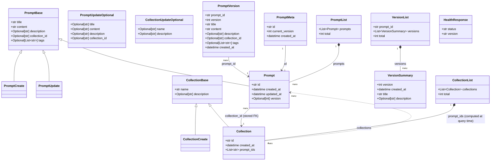

# Data Models

PromptLab uses Pydantic v2 for all data validation and serialization. Models are organized into four groups: Prompt models, Collection models, Versioning models, and Response containers. All persisted entities carry UUID identifiers generated at creation time.

## Class Diagram

## Prompt Models

| Model | Purpose | Extends |
|-------|---------|---------|
| `PromptBase` | Shared fields and validators for all prompt shapes | — |
| `PromptCreate` | Request body for `POST /prompts` | `PromptBase` |
| `PromptUpdate` | Request body for `PUT /prompts/{id}` (all fields required) | `PromptBase` |
| `PromptUpdateOptional` | Request body for `PATCH /prompts/{id}` (all fields optional) | — |
| `Prompt` | Persisted prompt entity returned by the API | `PromptBase` |

### Field Reference

| Field | Type | Constraints | Notes |
|-------|------|-------------|-------|
| `title` | `str` | 1–200 chars, stripped | Validated non-empty; SQL injection blocked |
| `content` | `str` | min 1 char | Validated non-empty; SQL injection blocked |
| `description` | `Optional[str]` | max 500 chars | Defaults to `None` |
| `collection_id` | `Optional[str]` | — | Foreign key to `Collection.id` |
| `tags` | `Optional[List[str]]` | Each tag non-empty | `None` = no tags |
| `id` | `str` | UUID4 | Auto-generated on `Prompt` creation |
| `created_at` | `datetime` | UTC, naive | Set once at creation; never overwritten |
| `updated_at` | `datetime` | UTC, naive | Auto-updated by `__setattr__` on field change |
| `version` | `Optional[int]` | Starts at 1 | Incremented by storage on each mutation |

### Validators on `PromptBase`

- `validate_content_non_empty` — rejects whitespace-only `title` or `content`
- `validate_no_sql_injection` — blocks common SQL injection patterns
- `validate_tags` — ensures every element in `tags` is a non-empty string

### `PromptUpdateOptional` note

This model is **not** a subclass of `PromptBase`. All fields are redeclared as `Optional` to support partial PATCH semantics. A `check_empty_values` validator normalizes whitespace-only strings to `None`.

> **Tags cannot be changed via PATCH.** `PromptUpdateOptional` deliberately omits the `tags` field. A PATCH body that includes `tags` will have the key silently ignored by FastAPI. To update tags, use `PUT /prompts/{id}` with the full prompt payload.

---

## Collection Models

| Model | Purpose | Extends |
|-------|---------|---------|
| `CollectionBase` | Shared fields for collections | — |
| `CollectionCreate` | Request body for `POST /collections` | `CollectionBase` |
| `CollectionUpdateOptional` | Request body for `PATCH /collections/{id}` | — |
| `Collection` | Persisted collection entity returned by the API | `CollectionBase` |

### Field Reference

| Field | Type | Constraints | Notes |
|-------|------|-------------|-------|
| `name` | `str` | 1–100 chars | Validated non-whitespace |
| `description` | `Optional[str]` | max 500 chars | Defaults to `None` |
| `id` | `str` | UUID4 | Auto-generated on creation |
| `created_at` | `datetime` | UTC, naive | Set once at creation |
| `prompt_ids` | `List[str]` | — | Populated at query time; not a FK constraint |

---

## Versioning Models

| Model | Purpose |
|-------|---------|
| `PromptVersion` | Immutable snapshot of a prompt at a specific version number |
| `PromptMeta` | Tracks the current version number and original `created_at` per prompt |
| `VersionSummary` | Lightweight summary used in list responses |
| `VersionList` | Paginated container for all version summaries of a prompt |

### Field Reference

| Field | Model | Type | Notes |
|-------|-------|------|-------|
| `prompt_id` | `PromptVersion`, `VersionList` | `str` | Links back to parent `Prompt` |
| `version` | `PromptVersion`, `VersionSummary` | `int` | Sequential, starts at 1 |
| `created_at` | `PromptVersion`, `PromptMeta`, `VersionSummary` | `datetime` | When the snapshot was taken |
| `id` | `PromptMeta` | `str` | Same as parent `Prompt.id` |
| `current_version` | `PromptMeta` | `int` | Highest version number for this prompt |
| `versions` | `VersionList` | `List[VersionSummary]` | Sorted newest-first |
| `total` | `VersionList` | `int` | Count of all versions |

---

## Response Container Models

| Model | Fields | Used by |
|-------|--------|---------|
| `PromptList` | `prompts: List[Prompt]`, `total: int` | `GET /prompts` |
| `CollectionList` | `collections: List[Collection]`, `total: int` | `GET /collections` |
| `HealthResponse` | `status: str`, `version: str` | `GET /health` |

---

## Security

- **HTML sanitization** — `Prompt.__init__` and `__setattr__` call `sanitize_html()` on `title`, `content`, and `description` to prevent XSS
- **SQL injection prevention** — `validate_no_sql_injection` blocks common patterns in string fields
- **ID validation** — `Prompt.id` is validated as a well-formed UUID4
