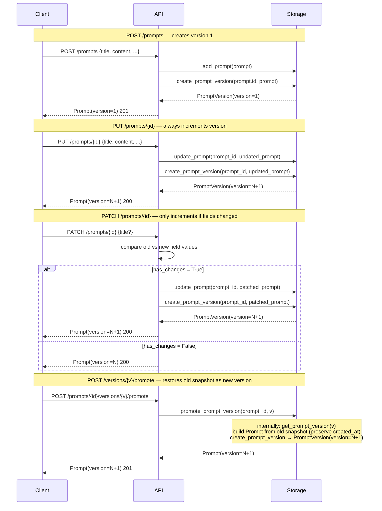
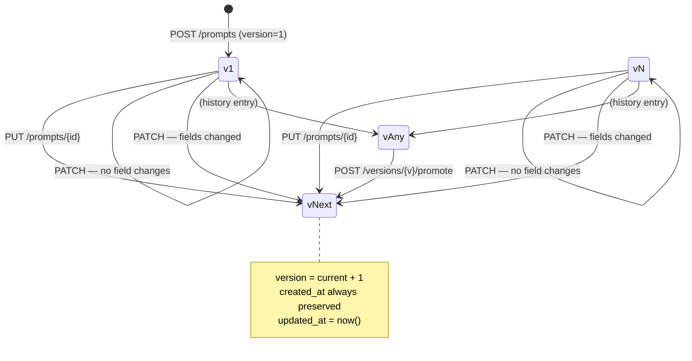

# Prompt Versions

Every mutation of a prompt (create, update, partial update, promote) produces an immutable version snapshot. This gives users a full audit trail and the ability to restore any previous state.

## Endpoints

| Method | Path | Description | Response |
|--------|------|-------------|----------|
| `GET` | `/prompts/{prompt_id}/versions` | List all versions (newest first) | `VersionList` |
| `GET` | `/prompts/{prompt_id}/versions/{version}` | Retrieve a specific version snapshot | `PromptVersion` |
| `POST` | `/prompts/{prompt_id}/versions/{version}/promote` | Restore an old version as the new latest | `Prompt` (201) |

### `GET /prompts/{prompt_id}/versions`

Returns a summary list of all versions for the prompt. Versions are ordered newest-first.

```json
{
  "prompt_id": "a1b2c3d4-...",
  "versions": [
    { "version": 3, "created_at": "2026-02-28T12:00:00", "title": "Final draft", "description": null },
    { "version": 2, "created_at": "2026-02-28T11:00:00", "title": "Revised draft", "description": null },
    { "version": 1, "created_at": "2026-02-28T10:00:00", "title": "Initial draft", "description": null }
  ],
  "total": 3
}
```

### `GET /prompts/{prompt_id}/versions/{version}`

Returns the full immutable snapshot for a specific version number.

```json
{
  "prompt_id": "a1b2c3d4-...",
  "version": 1,
  "title": "Initial draft",
  "content": "You are a helpful assistant...",
  "description": null,
  "collection_id": null,
  "tags": ["assistant", "general"],
  "created_at": "2026-02-28T10:00:00"
}
```

### `POST /prompts/{prompt_id}/versions/{version}/promote`

Copies the fields from an old version and creates a new version snapshot with those values, incrementing the version counter. The original `created_at` of the prompt is preserved.

Returns the updated `Prompt` with status `201 Created`.

---

## Version Creation Lifecycle



---

## Version State Transitions



---

## Key Behaviors

- **Immutability** — once a `PromptVersion` is written it is never mutated; historical snapshots are read-only
- **Sequential numbering** — versions start at `1` and increment by `1` with no gaps
- **Newest-first listing** — `GET /versions` returns versions sorted by version number descending
- **No-op detection** — a `PATCH` request that produces no field changes does not create a new version and does not increment the counter
- **Promote creates a new version** — promoting v1 when current is v3 creates v4; v3 remains in history unchanged
- **`created_at` preservation** — a promoted prompt retains the original `created_at` timestamp; only `updated_at` reflects the current time

---

## Storage Internals

Versioning data is spread across three in-memory dictionaries in `backend/app/storage.py`:

| Dict | Type | Contents |
|------|------|----------|
| `_prompts` | `Dict[str, Prompt]` | Current state of each prompt, including `version` field |
| `_prompt_versions` | `Dict[str, List[PromptVersion]]` | All immutable snapshots, keyed by `prompt_id` |
| `_prompt_meta` | `Dict[str, PromptMeta]` | Current version counter and original `created_at` per prompt |

`PromptMeta.current_version` is the authoritative counter. `create_prompt_version()` reads it, increments it, writes the new `PromptVersion`, and updates the meta record in a single call.
