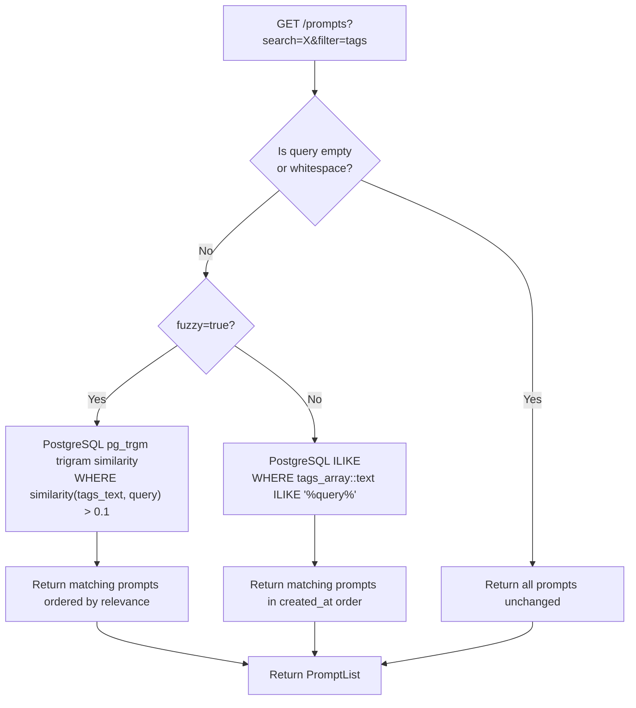

# Tagging System

Tags are an optional list of strings on every `Prompt`. They are stored as part of the prompt record, captured in every version snapshot, and searchable via the standard `GET /prompts` endpoint using `filter=tags`.

## Storage Model

Tags live on the `Prompt` model as `Optional[List[str]]`. `None` means the prompt has no tags; an empty list is also valid. Tags are persisted inline — there is no separate tags table or index.

```json
{
  "id": "a1b2c3d4-...",
  "title": "Code review assistant",
  "content": "You are an expert code reviewer...",
  "tags": ["code-review", "python", "engineering"],
  "version": 2
}
```

Tags are also captured in every `PromptVersion` snapshot, so historical versions accurately reflect the tags that were active at the time.

---

## Validation Rules

| Rule | Detail |
|------|--------|
| Type | Each element must be a `str` |
| Non-empty | Whitespace-only strings are rejected |
| No max count | No limit on number of tags per prompt |
| No max length | No character limit per individual tag |
| SQL injection | Blocked by `validate_no_sql_injection` on the parent `PromptBase` |
| HTML | Not explicitly sanitized in the tags field (sanitization applies to `title`, `content`, `description`) |

Validation is enforced by `validate_tags` in `PromptBase` (see [backend/app/models.py](../backend/app/models.py)).

---

## Search and Filter API

Tags are searchable via the standard list endpoint:

```
GET /prompts?search={query}&filter=tags&fuzzy={true|false}
```

| Parameter | Type | Default | Description |
|-----------|------|---------|-------------|
| `search` | `str` | — | Term to match against tags |
| `filter` | `str` | — | Set to `tags` to restrict matching to the tags field |
| `fuzzy` | `bool` | `true` | `true` = pg_trgm trigram similarity match; `false` = exact case-insensitive substring match |
| `collection_id` | `str` | — | Optional: pre-filter by collection before searching |
| `limit` | `int` | — | Pagination: max results to return |
| `offset` | `int` | `0` | Pagination: number of results to skip |

---

## Tag Search Decision Flow



---

## Tag Lifecycle

Tags travel with the prompt through every operation:

| Operation | Tag Behavior |
|-----------|-------------|
| `POST /prompts` | Tags set from request body; captured in version 1 snapshot |
| `PUT /prompts/{id}` | Tags fully replaced from request body; new version snapshot created |
| `PATCH /prompts/{id}` | Tags **cannot** be changed via PATCH — `PromptUpdateOptional` has no `tags` field. Existing tags are always preserved unchanged. Use `PUT` to update tags. |
| Version snapshot | `PromptVersion.tags` captures the exact tag list at the time of the snapshot |
| Promote | Promoted version restores the old snapshot's tag list as the new current tags |

---

## Example Requests

### Create a prompt with tags

```http
POST /prompts
Content-Type: application/json

{
  "title": "Code review assistant",
  "content": "You are an expert code reviewer...",
  "tags": ["code-review", "python", "engineering"]
}
```

### Add a tag via PUT

Tags can only be changed through a full replacement using `PUT`. `PATCH` does not support the `tags` field.

```http
PUT /prompts/a1b2c3d4
Content-Type: application/json

{
  "title": "Code review assistant",
  "content": "You are an expert code reviewer...",
  "tags": ["code-review", "python", "engineering", "new-tag"]
}
```

### Search prompts by tag (fuzzy)

```http
GET /prompts?search=python&filter=tags
```

### Search prompts by tag (exact substring)

```http
GET /prompts?search=python&filter=tags&fuzzy=false
```

### Search within a collection by tag

```http
GET /prompts?search=engineering&filter=tags&collection_id=c9d8e7f6
```

---

## Fuzzy Matching Details

Tag search is executed at the **database level** via `storage.get_prompts_page()`. The `utils.py:search_prompts` utility (which uses the `fuzzysearch` Python library) is not used for the main API route.

When `fuzzy=true` (the default), the database uses PostgreSQL `pg_trgm` trigram similarity:

- The `tags` array column is cast to text and compared using trigram similarity
- Similarity threshold: `> 0.1` (permissive, to surface partial matches)
- Results are ordered by similarity score descending — most relevant first
- Requires the `pg_trgm` PostgreSQL extension (enabled by default in the Docker setup)

When `fuzzy=false`, the database uses a case-insensitive `ILIKE` substring match:

- Equivalent to `WHERE tags::text ILIKE '%query%'`
- Results are returned in `created_at` descending order (no relevance scoring)
